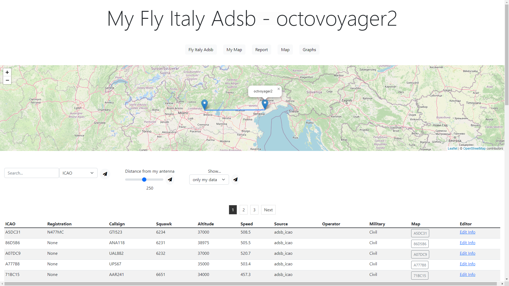

# myFlyItalyAdsb 🛩️

myFlyItalyAdsb is a lightweight web application designed to allow each user to visualize real-time flight data from their individual receiver. It integrates directly with `readsb`, `mlat-server` and provides a real-time flight table similar to VRS. Moreover, it offers comprehensive reporting features and the flexibility to modify aircraft details.



## Features 🌟

- **Real-time Map**: Visualize aircraft data without transmitting each `aircraft.json` to the server. Direct integration with `readsb`. Html is from `tar1090`
- **Live Flight Table**: A detailed table displaying all real-time flights, akin to VRS.
- **Database & Reporting**: Get insights from historical data. Reports can be filtered based on the receiver.
- **Aircraft Modification**: Edit any aircraft field effortlessly, including tagging an aircraft as military.
- **MLAT Connections Map**: Visualize the MLAT connections between the user's receiver and others on an interactive map, showcasing the network synergy.

## Access 🚪

Access is straightforward:
1. Direct access via the IP from which data is transmitted.
2. Through a unique UUID in /login page.

## Prerequisites 🛠️

- An instance of `mlat-server`.
- A properly compiled version of `readsb`:
  - Ensure it prints UUIDs in `aircraft.json`.
  - Should be executed with `--ingest` and `--net-receiver-id` flags.

## Installation ⚙️

1. Clone the repository:
   ```
   git clone https://github.com/flyitalyadsb/flarm-ogn-to-sbs.git
   cd flarm-ogn-to-sbs
   ```

2. Install the required dependencies:
   ```
   pip install -r requirements.txt
   ```

## ⚙️ Configuration and Execution with Docker Compose
### Configuration
By default, SQLite is used as the database. However, it is highly recommended to use PostgreSQL with asyncpg. An example connection string passed with `--url-db is`: `postgresql+asyncpg://${USER_DB}:${PASSWORD_DB}@{IP_DB}/${NAME_DB}`.

### Execution
1. Navigate to your repository's directory.

2. Use Docker Compose to run the service:
   ```
   docker-compose up -d
   ```

3. If you need to make configuration changes, modify the `docker-compose.yml` file and restart the service:

   ```
   docker-compose down && docker-compose up -d
   ```


## Command-Line Options for MyFlyitalyadsb ⚙️⚙️

### Main Options

- `--server-listen`: Specify the address and port for the server to listen on. Format: `'host:port'`. Default: `0.0.0.0:83`.
- `--debug`: Enables debug mode. Default is set to `False`.
- `--only-asyncio-debug`: Enables asyncio debug mode. Default is set to `False`.

### Readsb Options

- `--aircraft-json`: Path to the aircraft JSON data file. Default: `/json/aircraft.json`.
- `--receivers-json`: Path to the receivers JSON data file. Default: `/json/ingest/receivers.json`.
- `--clients-json`: Path to the clients JSON data file. Default: `/json/ingest/clients.json`.
- `--url-readsb`: URL to readsb service. Default: `https://mappa.flyitalyadsb.com/re-api/?all`.
- `--readsb-request-timeout`: Timeout duration for readsb requests (in seconds). Default: `3`.

### Mlat Server Options

- `--sync-json`: Path to the synchronization JSON data file. Default: `/mlat/sync.json`.
- `--clients-mlat-json`: Path to the mlat clients JSON data file. Default: `/mlat/clients.json`.

### Online Database Options

- `--online-db-path`: Local path for the online database storage. Default: `/dati`.
- `--url-online-db`: URL to fetch the online aircraft database. Default: `https://opensky-network.org/datasets/metadata/aircraftDatabase.zip`.

### Database Options

- `--url-db`: Database connection URL. Default: `sqlite+aiosqlite:////database/db.sqlite`.

### Unix Options

- `--unix`: Use Unix instead of HTTP for connecting to the readsb API. Default is set to `False`.
- `--unix_socket`: Path to the Unix socket for readsb API. Default: `unix:/run/readsb/api.sock`.

### Web Options

- `--per-page`: Specify the number of results displayed per page. Default: `50`.

### Update Frequencies Options

- `--aircraft-update`: Set the frequency of aircraft updates (in seconds). Default: `0.2`.
- `--clients-and-db-update`: Set the frequency of clients and database updates (in seconds). Default: `3`.


## Contribution ✨

Contributions are always welcome! If you wish to contribute, please open an issue or send a pull request.

## License 📄

This project is licensed under the MIT License - see the [LICENSE.md](LICENSE.md) file for details.

## Acknowledgments 👏

- Special thanks to wiedehopf and all open-source libraries and tools used in this project.
- Icons used are sourced from [IconFinder](https://www.iconfinder.com/).

---

If you encounter any issues or have suggestions, please open an issue on GitHub.
